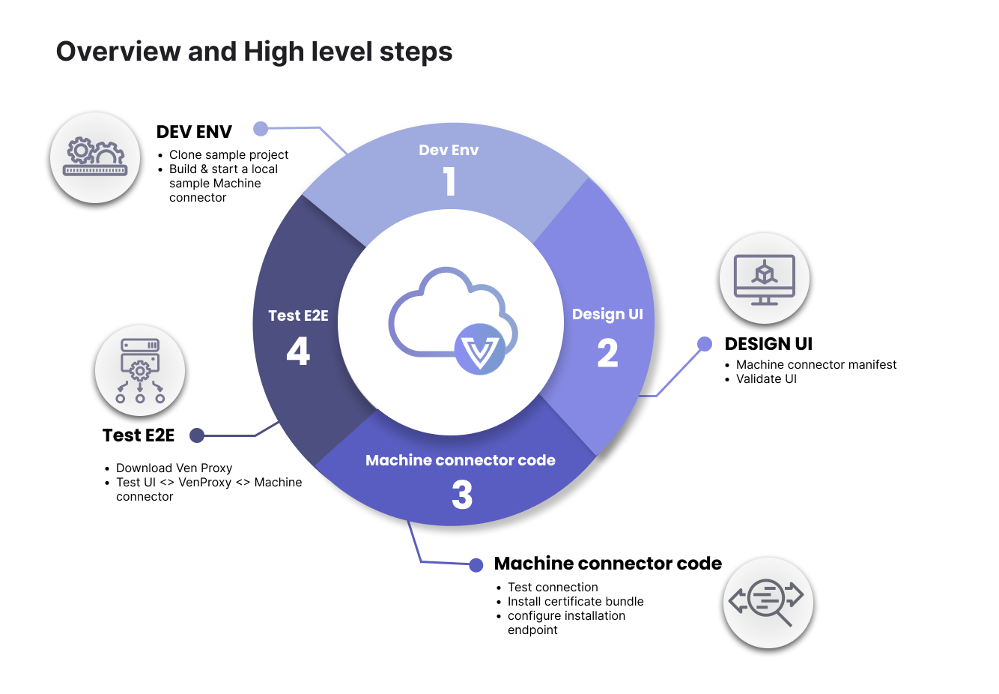
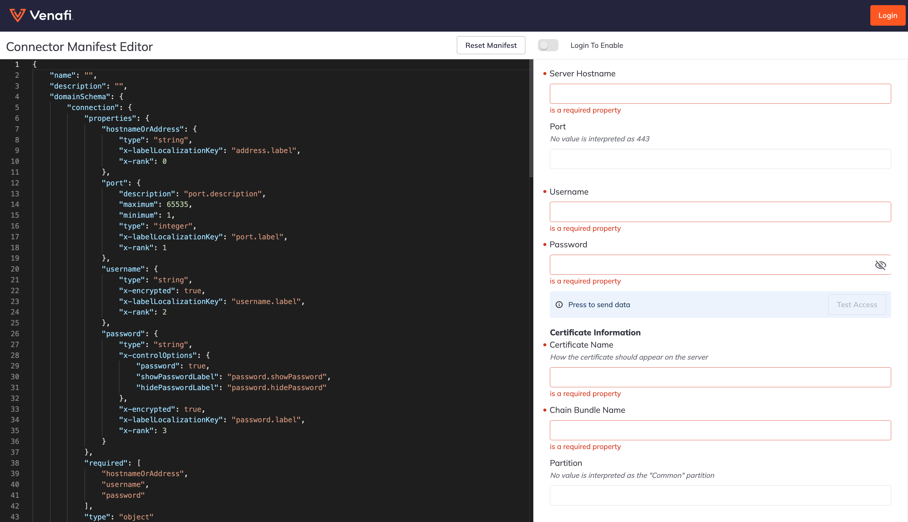

## What is a machine connector?

A machine connector is a plugin that acts as a middleware to communicate between the Venafi Platform to any 3rd party applications. The connector is responsible for authenticating, pushing, and configuring the certificate from Venafi to any application of the client's choice.

In the Venafi world, every connector is a REST-based web service with certain predefined APIs implemented to perform a task. Venafi provides a connector framework to help build more connectors easily to support the clients' ecosystem.

Change

## What is a machine connector framework?

The Venafi machine connector framework provides the following:

- Step-by-step guidance
- An easy to use template
- A faster way to build and test a TLS Protect Cloud connector

This connector framework focuses primarily on target application platforms such as web servers, network devices, etc. This framework makes it easy for developers to build a new connector in a few simple steps and removes the complexities of execution or supportability within the TLS Protect Cloud environment.

This connector framework gives the freedom and flexibility to define UI fields in the TLS Protect cloud management UI using JSON form components and the back-end as a REST web service. Venafi provides a simulation environment to seamlessly validate the UI and end-to-end execution so a developer can focus on writing the back-end connector code without worrying about the complex execution model.

<Note>
To work effectively with any Venafi connector framework, you must have some working knowledge of the Go Programming language.
</Note>

## How do I get started?



1. Set up your developer environment. You have to options in this step, choose the one that fits your needs.

    - **Sample push connector** - Download and unzip the `sample-push-connector` template. Here, we will walk you through building and running a local sample connector.

    - **VMware AVI OpenSource** - Clone our VMware AVI OpenSource connector. This option makes creating the manifest and the code much easier because this is a working pre-built, ready-to-go alternative that contains a manifest, source code, and makefile to create an image. The OpenSource connector provides developers with all the necessary components to construct a Docker image, ready for uploading to a container registry. From that point, developers can update the manifest to incorporate the container registry path and use it in TLSPC production. Note that you will need a registry for this option.

2. Design the UI (front-end). We will provide you with a default manifest editor. This environment allows you to develop and validate your data. We also provide you with a manifest reference, which allows you to customize your manifest to fit your needs.

3. Build connector code (back-end). Create the web-service back-end connector code using the files from the sample-push-connector template. The two files you will use are:

    - ***main.go*** - this file contains a declaration of the 3 APIs we will use.

    - ***handlers.go*** - this file contains the functions which implement these APIs. This is where we will define all the logic (e.g., how we connect to the server, how to install the certificate bundle, etc.).

    Again, as an alternative, you can also use our VMware AVI OpenSource connector in this step rather than the sample-push-connector template.

4. Test E2E. Test end to end via the manifest editor and the VenProxy simulation utility. The VenProxy simulation utility creates the bridge from the simulation environment to your locally connected developer environment. This is where we will validate that your front-end UI on the manifest editor is connected via the VenProxy simulator to your back-end connector code.

## Step 1: Set up your developer environment

Again, you have two options for this step. Use the sample-push-connector template, which is more of a manual hands-on approach to building your connector, or use the VMware AVI OpenSource pre-built, ready-to-go connector, saving significant time.

### Sample push connector option

For this walk-thru, we will provide you with a sample-push-connector template that you can use to add more logic and customize it to fit your environment.

1. Download and unzip the sample-push-connector template.

    Compile the sample-push-connector template.

1. Change the working directory to where the sample-push-connector is located.

1. Run the buildcommand and then run the sample-push-connector. That should start your connector on port 8080.

    <CodeGroup>

    ```go Linux
    $ go build
    go: downloading go.uber.org/zap v1.21.0
    go: downloading github.com/labstack/echo/v4 v4.6.1
    go: downloading gopkg.in/square/go-jose.v2 v2.6.0
    go: downloading golang.org/x/crypto v0.0.0-20210817164053-32db794688a5
    go: downloading go.uber.org/atomic v1.7.0
    go: downloading go.uber.org/multierr v1.6.0
    go: downloading golang.org/x/net v0.0.0-20210913180222-943fd674d43e
    go: downloading github.com/labstack/gommon v0.3.0
    go: downloading github.com/mattn/go-colorable v0.1.8
    go: downloading github.com/valyala/fasttemplate v1.2.1
    go: downloading github.com/mattn/go-isatty v0.0.14
    go: downloading golang.org/x/sys v0.0.0-20210910150752-751e447fb3d0
    go: downloading github.com/valyala/bytebufferpool v1.0.0
    go: downloading golang.org/x/text v0.3.7


    $ ./sample-connector
    {"level":"info","time":"2022-12-02T10:59:45-07:00","caller":"sample-push-connector/main.go:35","msg":"Sample Connector Starting"}
    {"level":"error","time":"2022-12-02T10:59:45-07:00","caller":"sample-push-connector/main.go:77","msg":"payload encryption key not found or readable","error":"open /keys/payload-encryption-key.pem: no such file or directory","stacktrace":"main.addPayloadEncryptionMiddleware\n\t/Users/john.dev/playground/sample-push-connector/main.go:77\nmain.main\n\t/Users/john.dev/playground/sample-push-connector/main.go:44\nruntime.main\n\t/usr/local/go/src/runtime/proc.go:250"}

    ____    __
    / __/___/ /  ___
    / _// __/ _ \/ _ \
    /___/\__/_//_/\___/ v4.6.1
    High performance, minimalist Go web framework
    https://echo.labstack.com
    ____________________________________O/_______
                                        O\
    ⇨ http server started on [::]:8080
    ```

    ```go Windows
    C:\Users\john.dev\OneDrive - VENAFI\Venafi\Codez\DevHub\sample-push-connector> go build
    go: downloading go.uber.org/zap v1.21.0
    go: downloading github.com/labstack/echo/v4 v4.6.1
    go: downloading gopkg.in/square/go-jose.v2 v2.6.0
    go: downloading golang.org/x/crypto v0.0.0-20210817164053-32db794688a5
    go: downloading go.uber.org/atomic v1.7.0
    go: downloading go.uber.org/multierr v1.6.0
    go: downloading golang.org/x/net v0.0.0-20210913180222-943fd674d43e
    go: downloading github.com/labstack/gommon v0.3.0
    go: downloading github.com/mattn/go-colorable v0.1.8
    go: downloading github.com/valyala/fasttemplate v1.2.1
    go: downloading github.com/mattn/go-isatty v0.0.14
    go: downloading golang.org/x/sys v0.0.0-20210910150752-751e447fb3d0
    go: downloading github.com/valyala/bytebufferpool v1.0.0
    go: downloading golang.org/x/text v0.3.7


    C:\Users\john.dev\OneDrive - VENAFI\Venafi\Codez\DevHub\sample-push-connector> .\sample-connector.exe
    {"level":"info","time":"2023-03-02T10:52:31-05:00","caller":"sample-push-connector/main.go:35","msg":"Sample Connector Starting"}
    {"level":"error","time":"2023-03-02T10:52:31-05:00","caller":"sample-push-connector/main.go:77","msg":"payload encryption key not found or readable","error":"open /keys/payload-encryption-key.pem: The system cannot find the path specified.","stacktrace":"main.addPayloadEncryptionMiddleware\n\tC:/Users/john.dev/OneDrive - VENAFI/Venafi/Codez/DevHub/sample-push-connector/main.go:77\nmain.main\n\tC:/Users/john.dev/OneDrive - VENAFI/Venafi/Codez/DevHub/sample-push-connector/main.go:44\nruntime.main\n\tC:/Program Files/Go/src/runtime/proc.go:250"}

    ____    __
    / __/___/ /  ___
    / _// __/ _ \/ _ \
    /___/\__/_//_/\___/ v4.6.1
    High performance, minimalist Go web framework
    https://echo.labstack.com
    ____________________________________O/_______
                                        O\
    ⇨ http server started on [::]:8080
    ```
    </CodeGroup>

### VMware AVI OpenSource option

If you choose to use our VMware AVI OpenSource connector, you will need to set up a container registry. A container registry is a repository or collection of repositories, used to store and access container images. Container registries can connect directly to container orchestration platforms such as Docker and Kubernetes.

<Info>

**Container repository** - storage for your containerized application images.

**Container registry** - acts as both a collection of container repositories and a searchable catalogue where you manage and deploy images.

</Info>

There are many container registries on the market, some notable ones are Docker Hub, Amazon ECR, Azure Container Registry, JFrog Container Registry, etc.

#### Dependencies
You will need the below dependencies to use this option:

- GNU Make 3.81
- jq - commandline JSON processor [version 1.6]
- go version go1.20
- Docker version 24.0.7
- golangci-lint has version 1.52.2

#### Setting up environment variables

To build an image that will be run within a Venafi Satellite for provision and/or discovery operations you will need to define a CONTAINER_REGISTRY environment variable.

```bash
export CONTAINER_REGISTRY=company.jfrog.io/connectors/vmware
```

##  Step 2: Design the UI (front-end)

You will create the front-end UI using the [manifest editor](https://login.venafi.cloud/playground/manifest-simulator "@embed"). As you build out your manifest, you can validate your data. See the below example:

<Note>

You will notice a "Login" button in the top right-hand corner. At this point, you do not need to login to start creating your manifest. Instead, you can begin to create your manifest, reset it if necessary, and edit it until you are happy with it. However, you must log in with your Venafi credentials when you are ready for end-to-end testing in step four.

</Note>



1. Build out your manifest using the JSON form. This manifest will dictate how your front-end UI will look. Use the left pane to change anything needed for your specific environment, and the results will be dynamically populated in the right pane of the editor. You can use the [manifest reference](#manifest-reference) to customize the UI based on your specific needs.

<Tip>
If you make a mistake and want to start over, just click the button on the top of the screen, "RESET MANIFEST."
</Tip>

<Warning>
Once you are happy with your UI, remember to make a copy and save it locally. Your session will not be saved on the [manifest editor](https://login.venafi.cloud/playground/manifest-simulator "@embed").
</Warning>

##  Step 3: Build connector code (back-end)

1. Create your web-service back-end connector code using the files from the [`sample-push-connector`](../assets/sample-push-connector-master.zip) template. There you will find two files (**main.go** and **handlers.go**). 
 
 The **main.go** file contains a declaration of 4 APIs we will be using:

<Info>
APIs

- **`/v1/testconnection`**  - This API takes the connection details and responds back with a success or failure connection to the system we are building a connection for.
- **`/v1/installcertificatebundle`** - This API takes the certificate bundle, connection details, and target information (key store) on where the certificate bundle needs to be installed. A handler must be defined to provide business logic on how to install a certificate bundle to the external system.
- **`/v1/configureinstallationendpoint`** - This API takes the connection details, endpoint details, and the JSON returned from `installcertificatebundle` and configures it. If the install command returns a 200 and a body such as ```{"mydetail":{"installed_certificate_id":23546324}}``` then the JSON sent to `configureinstallationendpoint` will contain the VaaS supplied data from the UI for "connection" and "binding" (e.g., endpoint fields from the UI) as well as "mydetail". In this example you would see  ```{"connection"{...},"binding":{...},"mydetail":{"installed_certificate_id":23546324}}```.
- **`/v1/discovercertificates`** - This API is recommended and indicates that your connector supports certificate discovery. 

</Info>